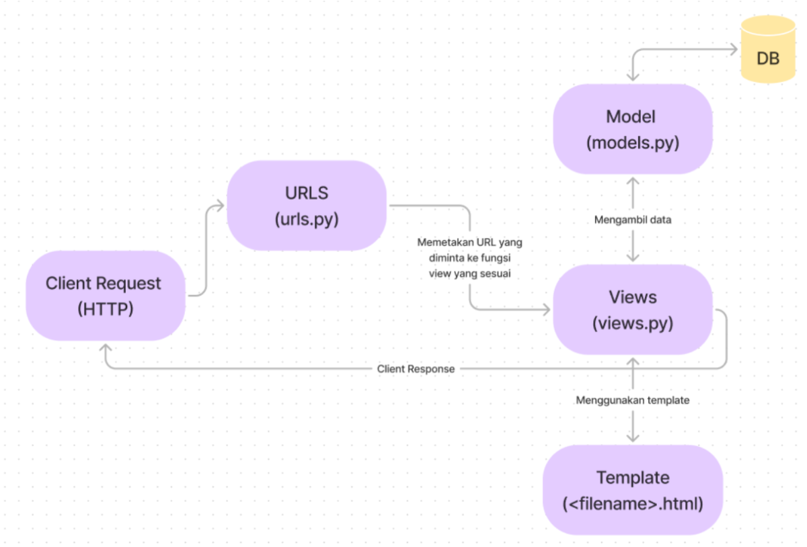
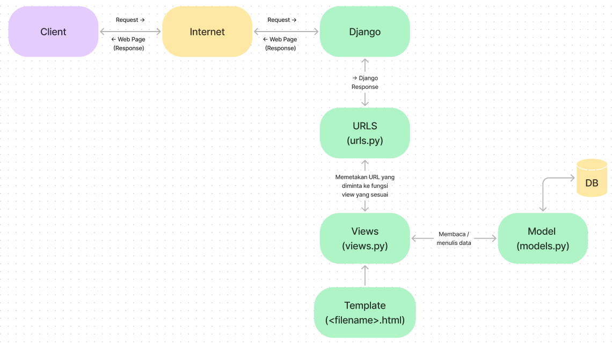
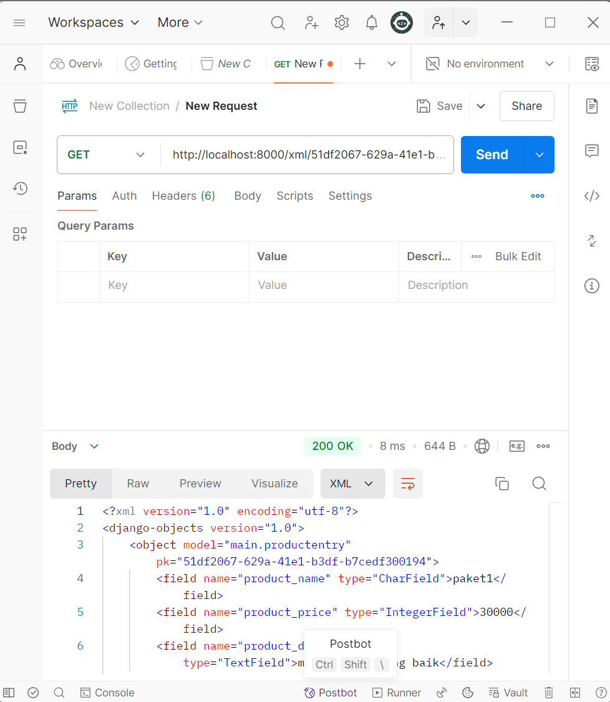
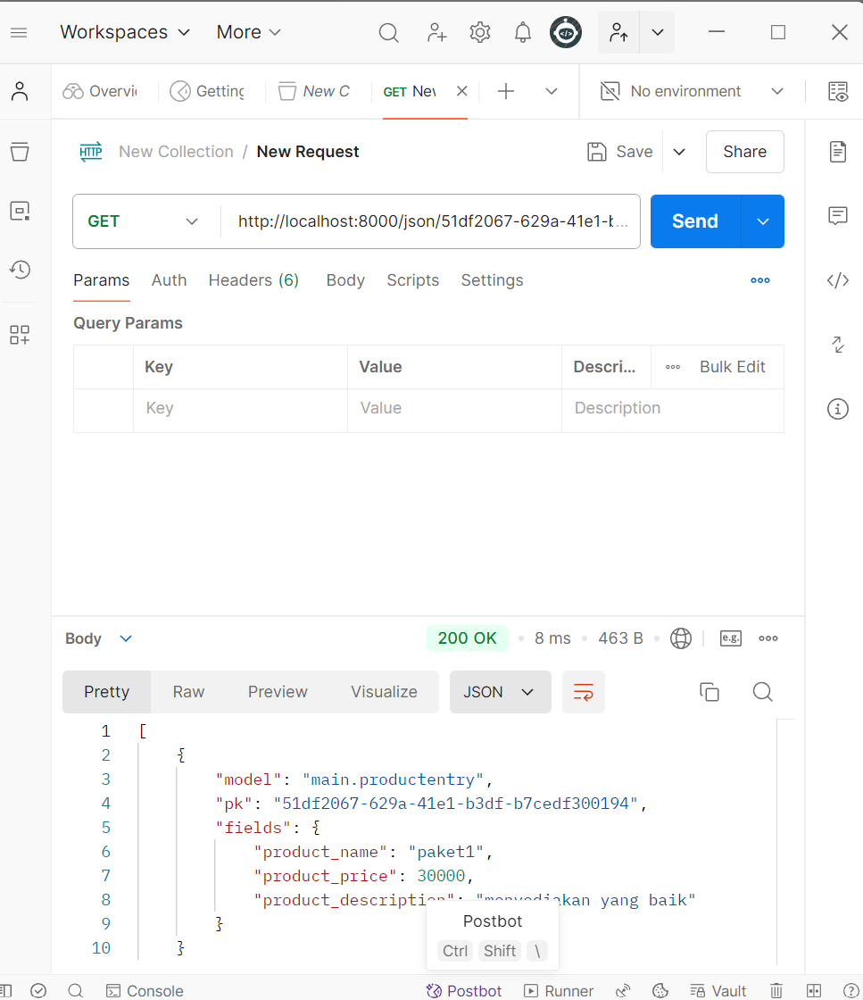
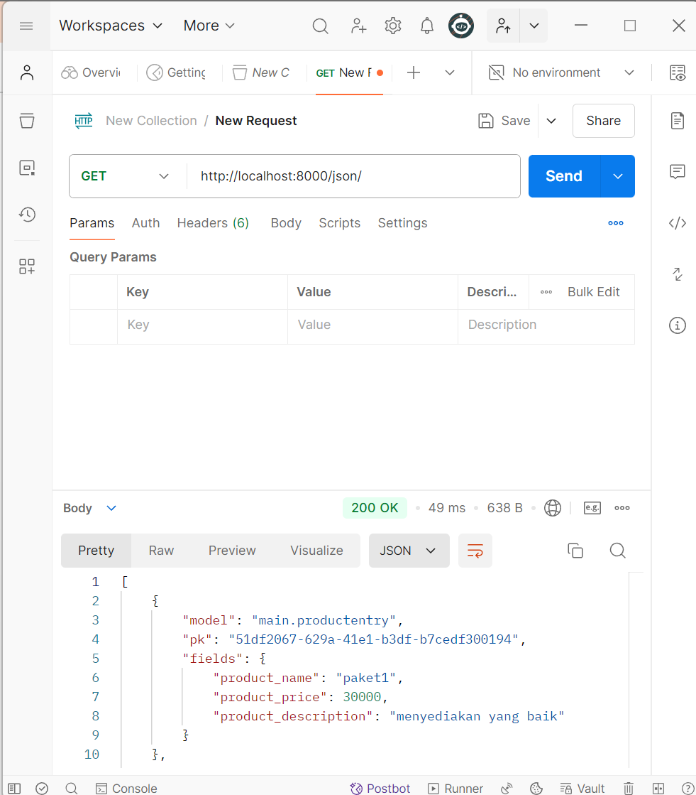
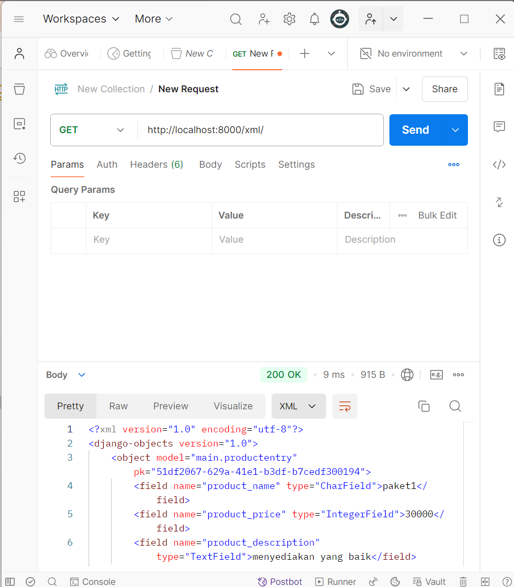

<details>
<summary> Tugas Individu 2 : Hobana Studio </summary>
Nama    : Clara Aurelia Setiady  <br>
NPM     : 23036217304  <br>
Kelas   : PBP C  

## Link PWS
http://clara-aurelia-hobanastudioo.pbp.cs.ui.ac.id

## Proses Pembuatan Proyek Django
1. Membuat repository baru dengan nama `hobana-studio`.
2. Membuat folder lokal baru dan menginisiasi git dengan:  
   ```bash
    git init
    ```
3. Clone repository tersebut dengan
    ```bash
   git clone <Link repository>
    ```
4. Mengaktifkan virtual environment dengan
   ```bash
   python -m venv env
    ```
    ```bash
   env\Scripts\activate
    ```
   - Virtual Environment ini membuat lingkungan terisolasi bagi proyek Python dan memungkinkan setiap proyek memiliki versi paket dan dependensi yang berbeda-beda tanpa mempengaruhi proyek lain. Berguna untuk menghindari konflik ketika bekerja pada banyak proyek.
    
8. Mempersiapkan modul / komponen yang diperlukan (library, framework, atau package) dengan membuat berkas requirements.txt yang berisi:
    ```
    django
    gunicorn
    whitenoise
    psycopg2-binary
    requests
    urllib3
    ```
    - Django -> framework web berbasis Python untuk membangun aplikasi web dengan cepat dan efisien.
    - Gunicorn -> Green Unicorn sebagai server produksi untuk aplikasi web Python dan menangani permintaan HTTP, agar ideal untuk deployment. 
    - WhiteNoise -> memungkinkan aplikasi untuk pengelolaan file statis (Ex: CSS, JavaScript, dan gambar) secara langsung tanpa memerlukan server HTTP tambahan.
    - Psycopg2-binary -> menghubungkan aplikasi Python dengan database query SQL.
    - Requests -> memudahkan pengiriman HTTP requests (GET / POST) dengan API sederhana, untuk mengambil data dari API eksternal.
    - Urllib3 -> mendasari requests, menyediakan alat untuk bekerja dengan koneksi HTTP, mendukung koneksi persistensi, menangani request HTTP
      
9. Meng-install requirements tersebut dengan
    ```
   python -m pip install -r requirements.txt
    ```
10. Membuat proyek Django dengan
    ```
    django-admin startproject hobana_studio .
    ```
12. Konfigurasi Proyek & Menjalankan Server. Pada settings.py, tambahkan string berikut pada ALLOWED_HOSTS:
    ```
    ...
    ALLOWED_HOSTS = ["localhost", "127.0.0.1"]
    ...
    ```
    Lalu, jalankan server dengan
    ```
    python manage.py runserver
    ```     
    - Dalam konteks deployment, `ALLOWED_HOSTS` berfungsi sebagai daftar host yang diizinkan untuk mengakses aplikasi web.  Dengan menetapkan nilai di atas, akan mengizinkan akses dari host lokal, artinya hanya bisa diakses dari jaringan sendiri saja. Namun, apabila men-deploy aplikasi ke suatu server, pastikan untuk menambahkan host dari server tersebut pada `ALLOWED_HOSTS`. Kalau jaringan lokal saja, berarti nama domain dan alamat IP khususnya `localhost` dan `127.0.0.1`. (sudah dapat diakses di `http://localhost:8000`)
    - Menghentikan Server -> `Control + C`    
    - Menonaktifkan Virtual Environment -> `deactivate`
14. Tambahkan berkas `.gitignore` dengan isi
    ```
    # Django
    *.log
    *.pot
    *.pyc
    __pycache__
    db.sqlite3
    media
    
    # Backup files
    *.bak
    
    # If you are using PyCharm
    # User-specific stuff
    .idea/**/workspace.xml
    .idea/**/tasks.xml
    .idea/**/usage.statistics.xml
    .idea/**/dictionaries
    .idea/**/shelf
    
    # AWS User-specific
    .idea/**/aws.xml
    
    # Generated files
    .idea/**/contentModel.xml
    .DS_Store
    
    # Sensitive or high-churn files
    .idea/**/dataSources/
    .idea/**/dataSources.ids
    .idea/**/dataSources.local.xml
    .idea/**/sqlDataSources.xml
    .idea/**/dynamic.xml
    .idea/**/uiDesigner.xml
    .idea/**/dbnavigator.xml
    
    # Gradle
    .idea/**/gradle.xml
    .idea/**/libraries
    
    # File-based project format
    *.iws
    
    # IntelliJ
    out/
    
    # JIRA plugin
    atlassian-ide-plugin.xml
    
    # Python
    *.py[cod]
    *$py.class
    
    # Distribution / packaging
    .Python build/
    develop-eggs/
    dist/
    downloads/
    eggs/
    .eggs/
    lib/
    lib64/
    parts/
    sdist/
    var/
    wheels/
    *.egg-info/
    .installed.cfg
    *.egg
    *.manifest
    *.spec
    
    # Installer logs
    pip-log.txt
    pip-delete-this-directory.txt
    
    # Unit test / coverage reports
    htmlcov/
    .tox/
    .coverage
    .coverage.*
    .cache
    .pytest_cache/
    nosetests.xml
    coverage.xml
    *.cover
    .hypothesis/
    
    # Jupyter Notebook
    .ipynb_checkpoints
    
    # pyenv
    .python-version
    
    # celery
    celerybeat-schedule.*
    
    # SageMath parsed files
    *.sage.py
    
    # Environments
    .env
    .venv
    env/
    venv/
    ENV/
    env.bak/
    venv.bak/
    
    # mkdocs documentation
    /site
    
    # mypy
    .mypy_cache/
    
    # Sublime Text
    *.tmlanguage.cache
    *.tmPreferences.cache
    *.stTheme.cache
    *.sublime-workspace
    *.sublime-project
    
    # sftp configuration file
    sftp-config.json
    
    # Package control specific files Package
    Control.last-run
    Control.ca-list
    Control.ca-bundle
    Control.system-ca-bundle
    GitHub.sublime-settings
    
    # Visual Studio Code
    .vscode/*
    !.vscode/settings.json
    !.vscode/tasks.json
    !.vscode/launch.json
    !.vscode/extensions.json
    .history
    ```
    - Berkas ini digunakan untuk menentukan berkas-berkas dan direktori yang dapat diabaikan oleh Git. Berkas yang tercantum tidak akan dilacak / diproses oleh Git

10. Unggah ke Repository dengan 
    ```
    git add .
    git commit -m "mau push git"
    git push -u origin <main>
    ```
    - Kalau ada perubahan dari repositorynya pull terlebih dahulu `git pull origin main`

11. Membuat aplikasi bernama main dengan
    ```
    python manage.py startapp main
    ```
    - Proyek (Project) adalah keseluruhan proyek web yang kamu bangun dengan menggunakan Django. Proyek berisi berbagai aplikasi yang berfungsi secara bersama untuk menciptakan situs web atau aplikasi web yang lengkap.
    - Aplikasi (Apps) adalah unit modular yang melakukan tugas-tugas spesifik dalam suatu proyek Django. Setiap aplikasi dapat memiliki model, tampilan, template, dan URL yang terkait dengannya. Aplikasi memungkinkanmu untuk membagi fungsionalitas proyek menjadi bagian-bagian terpisah yang dapat dikelola secara independen.
    - Ex : Django Project -> 1. Django App (Forum Diskusi), 2. Django App (List of Product), 3. Django App (Shopping Cart)

13. Menambahkan aplikasi tersebut ke `INSTALLED_APPS` pada berkas `settings.py`
    ```
    INSTALLED_APPS = [
        ...,
        'main'
    ]
    ```
14. Mengimplementasikan Template Dasar
    Pada main, buat direktori templates, lalu buat berkas baru main.html yang berisi:
    ```
    <h1>Aplikasi: </h1>
    <h1>{{ aplikasi }}</h1>
    
    <h5>NPM: </h5>
    <p>{{ npm }}<p>
    <h5>Name: </h5>
    <p>{{ name }}<p>
    <h5>Class: </h5>
    <p>{{ class }}<p>
    ```
    
14. Membuat views.py
    ```python
    from django.shortcuts import render
    
    # Create your views here.
    def show_main(request):
        context = {
            'aplikasi' : 'hobana studio',
            'npm' : '2306217304',
            'name': 'Clara Aurelia Setiady',
            'class': 'PBP C'
        }
    
        return render(request, "main.html", context)
    ```

15. Mengimplementasikan Model Dasar
Isi berkas models.py dengan  atribut name, price, description
    ```python
    from django.db import models
    
    class Product(models.Model):
        product_name = models.CharField(max_length=255)
        product_price = models.IntegerField
        product_description = models.TextField
    # Create your models here.
        @property
        def is_product_expensive(self):
            return self.product_price> 100000
    ```

16. Melakukan migrasi (cara Django melacak perubahan pada model basis data), 
    ```
    python manage.py makemigrations
    ```
    ```
    python manage.py migrate
    ```
    - Tiap kali ubah model atau nambah / ubah atribut harus melakukan migrasi

18. Menghubungkan View dan Template
    Integrasikan Komponen MVT. Pada view.py tambahkan:
    ```python
    from django.shortcuts import render
    
    # Create your views here.
    def show_main(request):
        context = {
            'aplikasi' : 'hobana studio',
            'npm' : '2306217304',
            'name': 'Clara Aurelia Setiady',
            'class': 'PBP C'
        }
    
        return render(request, "main.html", context)
    
    ```
    - Request -> objek permintaan HTTP yang dikirim oleh pengguna
    - Main.html -> berkas template yang digunakan untuk me-render tampilan
    - Context -> dictionary berisi data yang akan ditampilkan 

18. Routing URL, buat berkas `urls.py` di dalam direktori main, isi dengan:
    ```python
    from django.urls import path
    from main.views import show_main
    
    app_name = 'main'
    
    urlpatterns = [
        path(' ', show_main, name='show_main'),
    ]
    ```
    - urls.py untuk mengatur rute URL yang terkait dengan aplikasi main
    - Import path untuk mendefinisikan URL
    - Fungsi show_main sebagai tampilan yang akan ditampilkan ketika URL diakses
    - app_name diberikan untuk memberikan nama unik pada pola URL dalam aplikasi

19. Routing URL Proyek, buka berkas `urls.py` dalam direktori `hobana_studio` (bukan main), import fungsi include
    ```
    ...
    from django.urls import path, include
    ...
    ```
    
    ```
    urlpatterns = [
        ...
        path('', include('main.urls')),
        ...
    ]
    ```
    - urls.py pada proyek mengatur rute URL tingkat proyek
    - Include untuk mengimpor rute URL dari aplikasi lain (konteks ini, dari aplikasi main) ke dalam berkas urls.py proyek.
    - Path ‘ ‘ akan diarahkan ke rute yang didefinisikan dalam berkas urls.py aplikasi main. (kalau path nya ‘main/’, maka perlu akses https://localhost:8000/main/)

20. Deployment Melalui PWS, akses `https://pbp.cs.ui.ac.id` ,create new project (bebas), simpan project credentials, lalu pada settings.py proyek, tambahkan URL deployment PWS pada `ALLOWED_HOSTS` dengan format `<username-sso>-<nama proyek>.pbp.cs.ui.ac.id` -> `clara-aurelia-hobanastudio.pbp.cs.ui.ac.id`
    ```
    ALLOWED_HOSTS = ["localhost", "127.0.0.1", "clara-aurelia-hobanastudio.pbp.cs.ui.ac.id"]
    ```
    Apabila ada perubahan ketikkan:
    ```
    git push pws main:master
    ```


## 2. Buatlah bagan yang berisi request client ke web aplikasi berbasis Django beserta responnya dan jelaskan pada bagan tersebut kaitan antara urls.py, views.py, models.py, dan berkas html.



- **Client Request** -> User membuat permintaan HTTP (Ex: Mengunjungi URL di browser).
- **urls.py** -> memetakan URL yang diminta ke fungsi view yang sesuai di views.py
- **views.py** -> setelah URL diidentifikasi, Django memanggil fungsi view yang relevan di views.py. View berfungsi sebagai jembatan antara data yang diperlukan dari model dan template yang akan di-render.
- **models.py** -> View dapat berinteraksi dengan model di models.py untuk mengambil / memodifikasi data dari database. Model mendefinisikan struktur data dan bagaimana data disimpan di database.
- **Template html** -> View kemudian menggunakan template HTML untuk membangun halaman yang akan dikirim kembali ke client. Template berisi HTML dan dapat menggunakan variabel yang dikirim dari view untuk menampilkan data dinamis.
- **Client Response** -> Setelah template di render, hasilnya dikirim sebagai respons HTTP kembali ke Client dan Client dapat melihat tampilannya dalam browser web


## 3. Jelaskan fungsi git dalam pengembangan perangkat lunak!
- **Melacak Perubahan Kode**  
  Git mencatat setiap perubahan yang dilakukan, memungkinkan developer untuk melihat riwayat perubahan, memeriksa versi sebelumnya, dan membandingkan perbedaan antara versi. Git juga memungkinan pengembalian kode ke versi sebelumnya dengan muda.
- **Kolaborasi Tim**   
  Git memungkinkan developer untuk membuat branch untuk mengerjakan gitur / perbaikan baru secara terpisah. Setelah selesai, cabang dapat digabungkan (merge) kembali dengan kode utama.
- **Peningkatan Proses Pengembangan**   
  Git sering digunakan dalam pipeline Continuous Integration/Continuous Deployment (CI/CD) untuk otomatisasi build, pengujian, dan penyebaran kode. Ini meningkatkan efisiensi dan kecepatan pengembangan perangkat lunak.
- **Kolaborasi Terdistribusi**   
  Git adalah sistem terdistribusi, artinya setiap developer memiliki salinan lengkap dari seluruh riwayat proyek di repositori lokal mereka. Ini memungkinkan pengembang untuk bekerja secara offline dan sinkronisasi dengan repositori pusat saat mereka online.


## 4. Menurut Anda, dari semua framework yang ada, mengapa framework Django dijadikan permulaan pembelajaran pengembangan perangkat lunak?
- **Desain yang Terstruktur**   
  Django menyediakan berbagai fitur built-in (autentikasi, manajemen pengguna, dan admin panel) sehingga membantu pemula untuk fokus pada pengembangan fungsionalitas aplikasi.
- **Dokumentasi dan Komunitas yang Kuat**  
  Dokumentasi Django mencakup panduan, tutorial, dan referensi API yang membantu pemula memahami framework. Komunitas Django juga dapat dibilang besar dan aktif, sehingga banyak sumber daya tambahan untuk pembelajaran.
- **Efektif dan Efisien**  
  Django mudah diinstall dan sangat mudah untuk memulai aplikasi / proyek baru. Selain itu, Django memungkinkan pengembangan yang cepat berkat fitur-fitur seperti built-in autentikasi maupun ORM yang memudahkan interaksi dengan database. Django juga dirancang untuk berbagai skala, dari aplikasi kecil hingga proyek besar dan kompleks.
- **Penggunaan Python**  
  Bahasa pemrograman ini memiliki sintaks yang sederhana dan mudah dipahami, serta berguna untuk digunakan dalam berbagai bidang. Selain itu, Python memiliki ekosistem yang kaya dengan berbagai libraries dan tools yang dapat digunakan bersama Django.


## 5. Mengapa model pada Django disebut sebagai ORM?
- Model pada Django disebut sebagai ORM (Object-Relational Mapping) karena mereka merupakan bagian dari sistem ORM yang menghubungkan objek dalam kode Python dengan data yang disimpan dalam basis data relasional. ORM adalah teknik dalam pemrograman yang memungkinkan developer untuk berinteraksi dengan basis data menggunakan objek dan metode dalam bahasa pemrograman, alih-alih menggunakan SQL langsung.
</details>

<details>
<summary>Tugas 3: Implementasi Form dan Data Delivery pada Django</summary>
Nama    : Clara Aurelia Setiady  <br>
NPM     : 23036217304  <br>
Kelas   : PBP C  

## Proses Implementasi Checklist
### 1. Implementasi Skeleton sebagai Kerangka Views
   - Buat direktori `templates` pada direktori utama dan buat berkas HTML baru bernama `base.html`. Berkas ini berfungsi sebagai template dasar yang dapat digunakan sebagai kerangka umum untuk halaman web lainnya di dalam proyek.
       ```
       
       <!DOCTYPE html>
       <html lang="en">
       <head>
           <meta charset="UTF-8" />
           <meta name="viewport" content="width=device-width, initial-scale=1.0" />
            
       </head>
   
       <body>
            
       </body>
       </html>
       ```
 - Template tags `` berfungsi untuk memuat data secara dinamis dari Django ke HTML. Pada contoh di atas, tag tersebut di Django digunakan untuk mendefinisikan area dalam template yang dapat diganti oleh template turunan. Template turunan akan me-extend template dasar (pada contoh ini base.html) dan mengganti konten di dalam block ini sesuai kebutuhan.
- Lalu buka `settings.py` pada direktori `hobana_studio` dan tambahkan di bagian variabel `TEMPLATES`, agar berkas base.html terdekteksi sebagai berkas template
    ```
    ...
    TEMPLATES = [
        {
            'BACKEND': 'django.template.backends.django.DjangoTemplates',
            'DIRS': [BASE_DIR / 'templates'], # Tambahkan konten baris ini
            'APP_DIRS': True,
            ...
        }
    ]
    ...
    ```
    - Pastikan `APP_DIRS` bernilai True
- Ubah kode main.html di subdirektori main/templates/ dengan
    ```
    
    
    <h1>Mental Health Tracker</h1>

    <h5>NPM: </h5>
    <p>{{ npm }}<p>

    <h5>Name:</h5>
    <p>{{ name }}</p>

    <h5>Class:</h5>
    <p>{{ class }}</p>
    
    ```

    
### 2. Ubah Primary Key dari Integer ke UUID
 - Secara default, ID dari setiap objek model yang akan dibuat menggunakan tipe data integer yang incremental (start dari 1). Hal ini tidak aman karena bisa menjadi salah satu celah keamanan aplikasi Django
 - Untuk best practice harus ada perubahan di berkas models.py di subdirektori `main/`
    ```
    import uuid
    from django.db import models

    class Product(models.Model):
        id = models.UUIDField(primary_key = True, default=uuid.uuid4, editable=False)
        product_name = models.CharField(max_length=255)
        product_price = models.IntegerField
        product_description = models.TextField
    # Create your models here.
        @property
        def is_product_expensive(self):
            return self.product_price> 100000
    ```
    - Jangan lupa migrasi model karena ada perubahan dengan
    ```
    python manage.py makemigrations
    python manage.py migrate
    ```

    
### 3. Membuat form input data dan menampilkan data pada html
- Buat berkas baru pada direktori `main` dengan nama `forms.py` untuk membuat struktur form yang dapat menerima product baru. Lalu tambahkan kode berikut
```
from django.forms import ModelForm
from main.models import ProductEntry

class ProductEntryForm(ModelForm):
    class Meta:
        model = ProductEntry
        fields = ["product_name", "product_price", "product_description"]
```
 - `model = ProductEntry` untuk menunjukkan model yang akan digunakan untuk form, isi dari form akan disimpan dalam objek ProductEntry
 - `fields = ["product_name", "product_price", "product_description"]` untuk menunjukkan field dari model `ProductEntry` yang digunakan untuk form
- Buka berkas `views.py` pada direktori `main` dan tambahkan import berikut
```
from django.shortcuts import render, redirect   # Tambahkan import redirect di baris ini
from main.forms import ProductEntryForm
from main.models import ProductEntry
```
- Di `views.py` ini tambahkan untuk menghasilkan form yang dapat menambahkan data Product Entry secara otomatis ketika data disubmit dari form:
```
def create_product_entry(request):
    form = ProductEntryForm(request.POST or None)

    if form.is_valid() and request.method == "POST":
        form.save()
        return redirect('main:show_main')

    context = {'form': form}
    return render(request, "create_product_entry.html", context)
```
  - `form = ProductEntryForm(request.POST or None)` untuk membuat ProductEntryForm baru dengan memasukkan QueryDict berdasarkan input dari user pada `request.POST`.
  - `form.is_valid()` untuk memvalidasi isi input dari form tersebut
  - `form.save()` untuk membuat dan menyimpan data dari form
  - `return redirect ('main:show_main)` untuk melakukan redirect ke fungsi `show_main` pada views aplikasi `main` setelah data form berhasil disimpan
 - Ubah fungsi `show_main` yang udah ada di berkas views.py
    ```
    def show_main(request):
    product_entries = ProductEntry.objects.all()

    context = {
        'name': 'Clara Aurelia Setiady',
        'class': 'PBP C',
        'npm': '2306217304',
        'product_entries': product_entries
    }

    return render(request, "main.html", context)
    ```
     - `ProductEntry.objects.all()` untuk mengambil seluruh objek ProductEntry yang tersimpan pada database
- Buka `urls.py` yang ada pada direktori `main` dan import fungsi `create_product_entry`
```
from main.views import show_main, product_product_entry
```
- Tambahkan path URL ke variabel `urlpatterns` pada `urls.py` di `main`
```
urlpatterns = [
   ...
   path('create-product-entry', create_product_entry, name='create_product_entry'),
]
```
- Buat berkas HTML baru dengan nama `create_product_entry.html` pada direktori `main/templates`. Isi dengan kode
```
 

<h1>Add New Product Entry</h1>

<form method="POST">
  
  <table>
    {{ form.as_table }}
    <tr>
      <td></td>
      <td>
        <input type="submit" value="Add Product Entry" />
      </td>
    </tr>
  </table>
</form>


```
 - `<form method="POST>` untuk menandakan block untuk form dengan metode POST
 - ` adalah token yang berfungsi sebagai security dan di generate secara otomatis oleh Django untuk mencegah serangan berbahaya
 - `{{ form.as_table }} adalah template tag yang digunakan untuk menampilkan fields form yang sudah dibuat di `forms.py` sebagai table
 - `<input type="submit" value = "Add Product Entry"/>` digunakan sebagai tombol submit untuk mengirimkan request ke view `create_product_entry(request)'
- Buka `main.html` dan untuk menampilkan data produk dalam bentuk tabel serta tombol "Add New Product Entry" yang akan redirect ke halaman form dengan menambahkan kode berikut ke dalam ``
```
...

<p>Belum ada data product pada aplikasi.</p>

<table>
  <tr>
    <th>Product Name</th>
    <th>Product Price</th>
    <th>Product Description</th>
  </tr>
  
   Berikut cara memperlihatkan data produk di bawah baris ini 
   
  
  <tr>
    <td>{{product_entry.product_name}}</td>
    <td>{{product_entry.product_description}}</td>
    <td>{{product_entry.product_price}}</td>
  </tr>
  
</table>
 

<br />

<a href="">
  <button>Add New Product Entry</button>
</a>

```
- Coba jalankan 'http://localhost:8000/'


### 4. Mengembalikan Data dalam Bentuk XML
- Buka 'views.py' pada direktori 'main' dan tambahkan import
```
from django.http import HttpResponse
from django.core import serializers
```
- Setelah itu, buat fungsi baru yang menerima paramter request
```
def show_xml(request):
    data = ProductEntry.objects.all()
```
- Tambah return function berupa 'HttpResponse' yang berisi parameter data hasil query yang sudah diserialisasi menjadi XML dan parameter 'content_type="application/xml"'
```
def show_xml(request):
    data = ProductEntry.objects.all()
    return HttpResponse(serializers.serialize("xml", data), content_type="application/xml")
```
 - serializers -> untuk translate objek model menjadi format lain (contohnya XML)
- Buka `urls.py` pada direktori 'main' dan import fungsi barusan
```
from main.views import show_main, create_product_entry, show_xml
```


### 5. Mengembalikan Data dalam Bentuk JSON
- Pada `views.py` direktori 'main' buat sebuah fungsi baru dengan variabel di dalamnya yang menyimpan hasil query dari seluruh data yang ada pada ProoductEntry dan tmabahin return function
```
def show_json(request):
    data = ProductEntry.objects.all()
    return HttpResponse(serializers.serialize("json", data), content_type="application/json")
```
- Import fungsi barusan ke 'urls.py'
```
from main.views import show_main, create_product_entry, show_xml, show_json
```

- Tambahkan juga ke `urlpattern`
```
path('json/', show_json, name='show_json'),
```
- Bisa dicek dengan 'http://localhost:8000/json/'


### 6. Mengembalikan Data Berdasarkan ID dalam bentuk XML dan JSON
- Pada 'views.py' di direktori 'main' buat dua fungsi baru yang menerima parameter 'request' dan 'id', buat variabel terlebih dahulu
```
data = ProductEntry.objects.filter(pk=id)

def show_xml_by_id(request, id):
    data = ProductEntry.objects.filter(pk=id)
    return HttpResponse(serializers.serialize("xml", data), content_type="application/xml")

def show_json_by_id(request, id):
    data = ProductEntry.objects.filter(pk=id)
    return HttpResponse(serializers.serialize("json", data), content_type="application/json")
```
- Setelah itu import fungsi pada 'urls.py' dan tambahkan path url nya pada urlpatterns
```
from main.views import show_main, create_product_entry, show_xml, show_json, show_xml_by_id, show_json_by_id
```
```
path('xml/<str:id>/', show_xml_by_id, name='show_xml_by_id'),
path('json/<str:id>/', show_json_by_id, name='show_json_by_id'),
```


### 7. Penggunaan postman
- Jalankan server, lalu buat reuest baru dengan method 'GET'
- Melakukan Push ke PWS secara otomatis dengan
```
name: Push to PWS

on:
  push:
    branches: [ main ]
    paths-ignore:
        - '**.md'
  pull_request:
    branches: [ main ]
    paths-ignore:
        - '**.md'

jobs:
  build-and-push:
    runs-on: ubuntu-latest

    steps:
    - name: Checkout code
      uses: actions/checkout@v2
      with:
        fetch-depth: 0

    - name: Set up Git
      run: |
        git config --global user.name 'github-actions[bot]'
        git config --global user.email 'github-actions[bot]@users.noreply.github.com'

    - name: Check PWS remote, pull, merge, and push
      env:
        PWS_URL: ${{ secrets.PWS_URL }}
      run: |
          # Check if master branch exists locally
          if ! git show-ref --verify --quiet refs/heads/master; then
            echo "Creating master branch"
            git branch master
          fi
          
          # Switch to master branch
          git checkout master

          # Push to master branch and capture the output
          push_output=$(git push $PWS_URL main:master 2>&1)
          if [[ $? -ne 0 ]]; then
            echo "Push failed with output: $push_output"
            echo "Error: Unable to push changes. Please check the error message above and resolve any conflicts manually."
            exit 1
          fi
          echo "Push successful with output: $push_output"
```


## 2. Jelaskan mengapa kita memerlukan data delivery dalam pengimplementasian sebuah platform?
Data delivery penting untuk memastikan bahwa data yang dihasilkan, dikumpulkan, dan diproses oleh platform dapat diakses dan digunakan oleh berbagai pihak yang memerlukannya
- **Aksesibilitas dan Ketersediaan**   
  Memastikan data dapat diakses oleh pengguna yang membutuhkannya. Tanpa data delivery, pengguna mungkin tidak bisa mendapatkan data dengan cepat dan efisien
- **Integrasi Antarsistem**
  Data Delivery penting dalam pertukaran data antara sistem yang berbeda, seperti API, layanan web, atau database, sehingga setiap bagian dari ekosistem platform bisa saling berkomunikasi
- **Optimasi Kinerja dan Efisiensi**
  Data Delivery memastikan bahwa data ditransfer dengan cepat dan tanpa hambatan, sehingga platform dapat berjalan dengan baik dan lancar


## 3. Menurutmu, mana yang lebih baik antara XML dan JSON? Mengapa JSON lebih populer dibandingkan XML?
Menurut saya, XML dan JSON masing-masing memiliki kelebihan masing-masing. Meskipun begitu, JSON lebih populer dan dianggap lebih baik dikarenakan kesederhanaan dan keringkasannya. Berikut beberapa alasan tambahan yang mendukung pernyataan sebelumnya:
- **Lebih Cepat dan Efisien**   
  JSON lebih ringan dan pengiriman datanya lebih efisien jika dibandingkan dengan XML. Ukurannya yang lebih kecil membuat waktu pengirimannya lebih cepat dan penggunaan bandwidthnya lebih
- **Penggunaan dalam API dan Web Services**
  Banyak layanan API modern menggunakan JSON sebagai format default untuk komunikasi data
- **Parsing yang Lebih Mudah**
  JSON lebih cepat untuk diparse, terutama karena dukungannya yang menjadi bawaan di banyak bahasa pemrograman (JavaScript, Python, Ruby, dll)


## 4. Jelaskan fungsi dari method is_valid() pada form Django dan mengapa kita membutuhkan method tersebut?
  Method is_valid() pada form Django berfungsi untuk melakukan validasi data yang dimasukkan oleh pengguna melalui form. Method ini memastikan bahwa data yang diterima sesuai dengan aturan validasi yang telah didefinisikan dalam form tersebut.
  
  Alur Penggunaan:
  - Data Input: Pengguna mengirimkan data ke form (misalnya melalui formulir HTML).
  - Inisialisasi Form: Django membuat objek form dan mengisi data dari request POST ke form tersebut.
  - Validasi Data: is_valid() dijalankan untuk memeriksa apakah data yang diisi valid.
    - Jika valid, data bersih dapat diakses melalui form.cleaned_data dan dapat disimpan atau diproses lebih lanjut.
    - Jika tidak valid, error message dapat diambil dari form.errors dan ditampilkan kembali kepada pengguna.

**Mengapa Kita Membutuhkan is_valid()?**
- **Memastikan Keamanan Data:**
  Validasi data sangat penting untuk menjaga aplikasi dari data yang tidak sah atau berpotensi merusak. Misalnya, kita dapat memeriksa apakah data yang diterima adalah dalam format yang benar (seperti email, angka, tanggal, dsb.).
- **Mencegah Kesalahan Logika dan Aplikasi:**
  Jika data yang tidak valid diproses langsung tanpa validasi, ini dapat menyebabkan kesalahan dalam aplikasi, seperti crash, operasi yang gagal, atau data yang tidak diinginkan disimpan di basis data.
- **Penanganan Error yang Efisien:**
  Dengan is_valid(), pengembang dapat dengan mudah menangani error, karena pesan kesalahan otomatis dikumpulkan dan dapat ditampilkan di halaman form sehingga pengguna bisa memperbaiki input mereka.


## 5. Mengapa kita membutuhkan csrf_token saat membuat form di Django? Apa yang dapat terjadi jika kita tidak menambahkan csrf_token pada form Django? Bagaimana hal tersebut dapat dimanfaatkan oleh penyerang?
  `crsf_token` berguna untuk melindungi aplikasi dari serangan CSRF (Cross-Site Request Forgery). CSRF adalah jenis serangan di mana penyerang mencoba mengelabui pengguna yang telah diautentikasi untuk melakukan aksi yang tidak sah di situs web
  Alasan Menggunakan csrf_token:
   - CSRF token adalah mekanisme keamanan yang memastikan bahwa form yang dikirimkan berasal dari sumber yang sah (pengguna yang valid) dan bukan dari situs eksternal yang berbahaya.
   - Token ini adalah string acak yang dihasilkan secara unik untuk setiap sesi pengguna atau request tertentu, dan harus dikirimkan bersama form untuk memvalidasi bahwa aksi yang dilakukan oleh pengguna sah.

   Jika kita tidak menambahkan csrf_token pada form di Django, aplikasi menjadi rentan terhadap serangan CSRF. Tanpa token ini, penyerang dapat membuat sebuah halaman yang berisi form tersembunyi atau skrip yang secara otomatis mengirimkan permintaan ke aplikasi Django. Jika pengguna sudah login ke aplikasi tersebut, permintaan akan diproses seolah-olah itu permintaan yang sah, meskipun sebenarnya dimanipulasi oleh penyerang.
   Penyerang bisa:
   - Mengirimkan permintaan palsu ke server atas nama pengguna yang sah tanpa sepengetahuan mereka.
   - Melakukan aksi tidak sah seperti perubahan password, transaksi finansial, atau pengiriman data sensitif jika pengguna sudah login dan terautentikasi.
   - Menggunakan metode seperti phishing, di mana pengguna diarahkan ke halaman berbahaya yang mengirimkan permintaan CSRF ke aplikasi yang rentan.
   Contohnya, jika sebuah aplikasi bank tidak menggunakan csrf_token, penyerang bisa mengirimkan form tersembunyi dari situs lain yang, ketika dibuka oleh pengguna yang sudah login, akan mengirimkan permintaan transfer uang tanpa disadari.

   Dengan csrf_token, server bisa memverifikasi apakah permintaan itu sah berasal dari aplikasi itu sendiri, sehingga mencegah serangan CSRF.


## 6. Screenshot Postman




</details>

<details>
  <summary> Tugas Individi 4 : Implementasi Autentikasi, Session, dan Cookies pada Django</summary>
  Nama    : Clara Aurelia Setiady  <br>
  NPM     : 23036217304  <br>
  Kelas   : PBP C  

  ## Proses Implementasi
  1. Mengimplementasikan Fungsi Registrasi, Login, dan Logout
  - Tambahkan import `UserCreationForm` dan `messages` pada `views.py` subdirektori `main`
  ```
  from django.contrib.auth.forms import UserCreationForm
  from django.contrib import messages
  ```
    - `UserCreationForm` memudahkan pembuatan registration form.
  - Tambahkan fungsi `register` ke dalam file tersebut untuk menghasilkan formulir registrasi secara otomatis dan menghasilkan akun pengguna ketika data sudah disubmit dari form.
  ```
  def register(request):
      form = UserCreationForm()

      if request.method == "POST":
          form = UserCreationForm(request.POST)
          if form.is_valid():
              form.save()
              messages.success(request, 'Your account has been successfully created!')
              return redirect('main:login')
      context = {'form':form}
      return render(request, 'register.html', context)
  ```
  - Buat file baru dengan `register.html` . Isi dengan:
  ```
  

  
  <title>Register</title>
  

  

  <div class="login">
    <h1>Register</h1>

    <form method="POST">
      
      <table>
        {{ form.as_table }}
        <tr>
          <td></td>
          <td><input type="submit" name="submit" value="Daftar" /></td>
        </tr>
      </table>
    </form>

    
    <ul>
      
      <li>{{ message }}</li>
      
    </ul>
    
  </div>

  
  ```
  - Pada `urls.py` import fungsi register tadi dan juga urlpatterns
  ```
  from main.views import register
  ```
  ```
  urlpatterns = [
      ...
      path('register/', register, name='register'),
  ]
  ```
  
  2. Membuat Fungsi Login
  - Pada `views.py` , import `authenticate`, `login`, `AuthenticationForm`
  ```
  from django.contrib.auth.forms import UserCreationForm, AuthenticationForm
  from django.contrib.auth import authenticate, login
  ```
    - `authenticate` dan `login` adalah fungsi bawaan Django
  - Tambahkan function `login_user` pada `views.py`
  ```
  def login_user(request):
    if request.method == 'POST':
        form = AuthenticationForm(data=request.POST)

        if form.is_valid():
              user = form.get_user()
              login(request, user)
              return redirect('main:show_main')

    else:
        form = AuthenticationForm(request)
    context = {'form': form}
    return render(request, 'login.html', context)
  ```
  - Buat berkas dengan nama `login.html`, isi dengan
  ```
  

  
  <title>Login</title>
  

  
  <div class="login">
    <h1>Login</h1>

    <form method="POST" action="">
      
      <table>
        {{ form.as_table }}
        <tr>
          <td></td>
          <td><input class="btn login_btn" type="submit" value="Login" /></td>
        </tr>
      </table>
    </form>

    
    <ul>
      
      <li>{{ message }}</li>
      
    </ul>
     Don't have an account yet?
    <a href="">Register Now</a>
  </div>

  
  ```
  - Pada `urls.py` tambahkan import fungsi dan path url
  ```
  from main.views import login_user
  ```
  ```
  urlpatterns = [
    ...
    path('login/', login_user, name='login'),
  ]
  ```
  3. Membuat Fungsi Logout
  - Pada `views.py` tambahkan import logout dan fungsi di bawah:
  ```
  from django.contrib.auth import logout
  ```
  ```
  def logout_user(request):
    logout(request)
    return redirect('main:login')
  ```
  - Pada `main/templates` dan tambahkan kode berikut:
  ```
  <a href="">
    <button>Logout</button>
  </a>
  ```
  - Buka `urls.py` dan `urlpatterns`
  ```
  from main.views import logout_user
  ```
  ```
  urlpatterns = [
    ...
    path('logout/', logout_user, name='logout'),
  ]
  ```

  4. Merestriksi Akses Halaman Main
  - Pada `views.py` dan tambahkan import `login_required`
  ```
  from django.contrib.auth.decorators import login_required
  ```
  -Untuk membuat halaman main hanya dappat diakses oleh pengguna yang sudah login, tambahkan potongan kode berikut di atas fungsi `show_main`
  ```
  @login_required(login_url='/login')
  def show_main(request):
  ```

  5. Menggunakan Data dari Cookies
  - Pada `views.py`, tambahkan:
    ```
    import datetime
    from django.http import HttpResponseRedirect
    from django.urls import reverse
    ```
  - Pada function `login_user`, tambahkan fungsionalitas tambah cookie (untuk melihat kapan terakhir kali pengguna login)
  ```
  if form.is_valid():
    user = form.get_user()
    login(request, user)
    response = HttpResponseRedirect(reverse("main:show_main"))
    response.set_cookie('last_login', str(datetime.datetime.now()))
    return response
  ```
  - Tambahkan kode `last_login` berikut ke variabel context
  ```
  context = {
      'name': 'Pak Bepe',
      'class': 'PBP D',
      'npm': '2306123456',
      'mood_entries': mood_entries,
      'last_login': request.COOKIES['last_login'],
  }
  ```
  - Ubah fungsi `logout_user`
  ```
  def logout_user(request):
      logout(request)
      response = HttpResponseRedirect(reverse('main:login'))
      response.delete_cookie('last_login')
      return response
  ```

  6. Menghubungkan Model dengan User
  - Pada `models.py`, tambahkan kode berikut:
  ```
  from django.contrib.auth.models import User
  ```
  - Tambahkan potongan kode berikut pada model yang sudah dibuat:
  ```
  class ProductEntry(models.Model):
      user = models.ForeignKey(User, on_delete=models.CASCADE)
      ...
  ```
  - Pada `views.py`, ubah kode create_product_entry
  ```
  def create_product_entry(request):
      form = ProductEntryForm(request.POST or None)

      if form.is_valid() and request.method == "POST":
          product_entry = form.save(commit=False)
          product_entry.user = request.user
          product_entry.save()
          return redirect('main:show_main')

      context = {'form': form}
      return render(request, "create_product_entry.html", context)
  ...
  ``` 
  - Ubah `product_entries` dan `context` pada `show_main`   
  ```
  def show_main(request):
      mood_entries = MoodEntry.objects.filter(user=request.user)

      context = {
          'name': request.user.username,
      }
  ```  
</details>